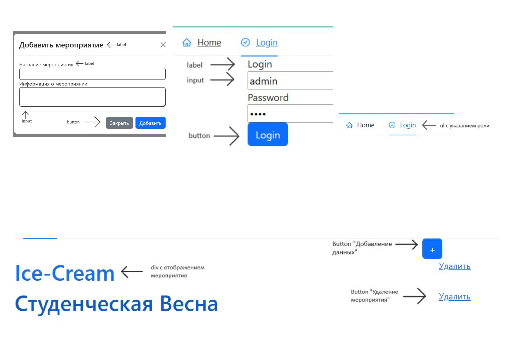
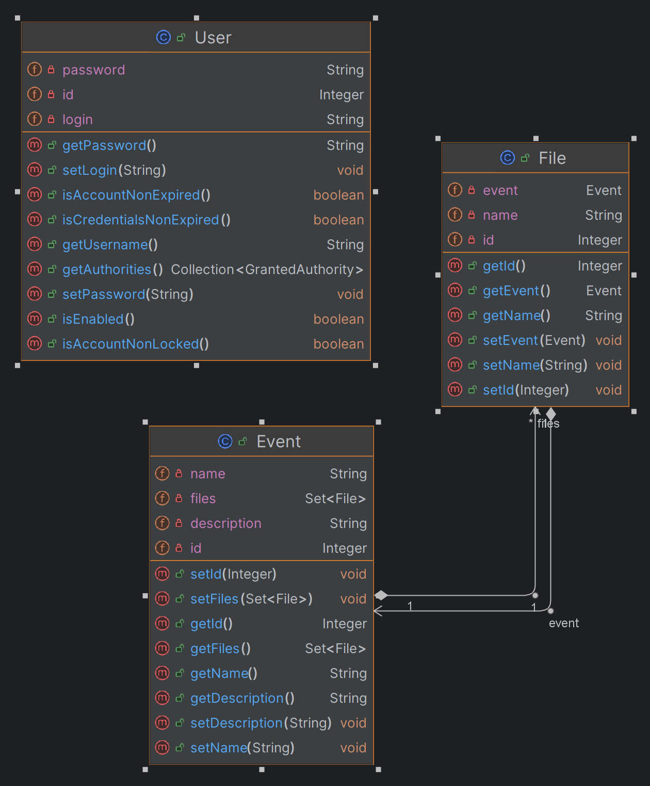

# Курсовой проект "Разработка веб-сервиса поддержки цифрового следа"
----------------
**Описание**:

Проект "Разработка веб-сервиса поддержки цифрового следа" на Spring Boot направлен на создание инструмента для удобного и безопасного хранения файлов и данных о мероприятиях. Этот веб-сервис предоставляет пользователю возможность эффективно управлять цифровым следом своих мероприятий, обеспечивая удобный доступ к необходимым ресурсам и информации.

**Скриншот рабочего окна приложения**:

## Архитектура

На диаграмме представлены основные классы программы

## Зависимости

Зависимости, которые должны быть установлены для работы этого программного обеспечения:
1. Язык программирования: Java
2. Фреймворк: Spring Boot (рекомендуемая версия, совместимая с вашей версией Java)
3. База данных: PostgreSQL
4. Инструменты сборки: для сборки проекта рекомендуется использовать Gradle.
   
Для клиентской части веб-сервиса на Spring Boot потребуются следующие ресурсы и зависимости:
1. Языки разметки и программирования:
HTML,
CSS,
JavaScript
2. Фреймворк для фронтенда - React.js

## Установка

Подробная инструкция по установке:

**Установка, настройка и запуск проекта: Клиентская часть**:
1. Установка необходимых инструментов:
  - Убедитесь, что на вашем компьютере установлен Node.js и npm (Node Package Manager). Если нет, установите их с официального сайта [nodejs.org](https://nodejs.org/en)
2. Клонирование репозитория:
  - Склонируйте репозиторий с клиентской частью проекта с помощью Git (git clone <ссылка_на_репозиторий>)
3. Установка зависимостей:
  - Перейдите в директорию проекта (cd <директория_проекта>)
4. Установите все зависимости, указанные в файле package.json, выполнив команду npm install
5. Настройка:
  - Настройте необходимые параметры, такие как адрес сервера API, порт и другие, в файле конфигурации клиентской части, если это необходимо.
6. Запуск:
  - После установки зависимостей запустите клиентскую часть проекта с помощью команды npm start или npm run dev

**Установка, настройка и запуск проекта: Серверная часть**:
1. Установка необходимых инструментов:
  - Убедитесь, что на вашем компьютере установлен Java Development Kit (JDK) версии 8 или выше. Если нет, установите JDK с официального сайта Oracle или OpenJDK.
2. Клонирование репозитория:
  - Склонируйте репозиторий с серверной частью проекта с помощью Git (git clone <ссылка_на_репозиторий>)
3. Настройка базы данных:
  - Убедитесь, что у вас установлена и настроена база данных, указанная в проекте. Создайте базу данных и пользователя с необходимыми правами доступа, если это необходимо.
4. Настройка:
  - Настройте параметры подключения к базе данных в файле application.properties.
5. Сборка и запуск:
  - Перейдите в директорию проекта (cd <директория_проекта>)
  - Соберите проект с помощью Maven (или Gradle, если вы используете его) - mvn clean install
  - После успешной сборки запустите серверную часть проекта: java -jar target/<имя_jar_файла>.jar
После запуска сервер будет доступен по адресу http://localhost:8080 (или другой порт, если вы его изменяли).

Теперь клиентская и серверная части вашего проекта должны быть успешно установлены, настроены и запущены.

## Описание API

Описание API микросервиса «Поддержки цифрового следа»

Основная информация 
|    Описание   |    Значение   |
| ------------- | ------------- |
| Роль в системе  | Микросервис для управления файлами и данными о мероприятиях в системе цифрового следа.  |
| Задача  | Обеспечить хранение информации о мероприятиях. Обеспечить возможность хранения и загрузки файлов, связанных с мероприятиями |
| Сценарий  | Пользователи могут создавать, просматривать, редактировать и удалять записи о мероприятиях. Могут загружать файлы, связанные с мероприятиями, и просматривать их. |

